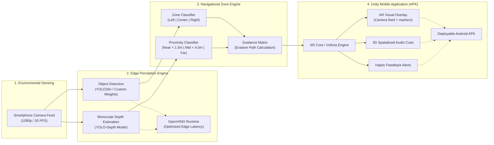

# Ishara (إشارة) — Assistive Campus Navigation for Visually Impaired Students

<p align="center">
  
  
  
  
  
  
  
  
</p>

---

## 📖 Executive Summary

University campuses are designed with the assumption that every student can visually inspect signage, read room placards, and build mental spatial maps on the fly. For blind and low-vision students, navigating unfamiliar, crowded corridors between classes is a high-effort task requiring memorized routes and tactile exploration. Existing assistive tools (white canes, guide dogs, tactile maps, RFID beacons) are either strictly **proximity-only** or dependent on **expensive, static physical infrastructure**.

**Project Ishara** bridges this critical gap within the **Healthcare & Assistive Technology** domain. By combining real-time edge computer vision (object detection + monocular depth estimation) with an **Android AR client (Unity)**, Ishara empowers students with continuous spatial awareness, dynamic obstacle avoidance through two parallel output channels: a live AR camera overlay for partially sighted users who retain some functional vision, and audio-haptic cues for users who need fully non-visual guidance.

> [!WARNING]
> ### 🩺 Healthcare & Assistive Aid Advisory (Non-Reliance Notice)
> **Auxiliary Assistive Aid Only — Not for Sole Reliance**
>
> Project Ishara is an auxiliary perception tool intended solely to augment environmental spatial awareness for blind and low-vision individuals. **It is NOT a certified medical diagnostic device, clinical prosthesis, or primary mobility substitute.**
>
> Users and caregivers must **NEVER** place sole reliance on this software for solitary navigation or life safety. It is engineered to complement, and must always be used alongside, primary mobility aids including the **white cane, guide dog, and certified Orientation & Mobility (O&M) training**. Always maintain primary physical contact and environmental awareness while navigating.

> 📄 **Read the Full Academic Problem Statement**: [docs/PROBLEM_STATEMENT.md](docs/PROBLEM_STATEMENT.md)

---

## 🏗️ System Architecture



---

## 📂 Repository Structure

The repository is organized as a modular monorepo cleanly separating mobile application development, machine learning models, video datasets, and research documentation:

```
Ishara/
├── .gitignore                       # Master Git hygiene configuration (protects large data)
├── README.md                        # Project flagship documentation (this file)
│
├── Ishara_Unity/                    # 🎮 Unity Mobile AR Client (Outputs Android APK)
│   ├── Assets/                      # C# scripts, Vuforia configs, Scenes, Input systems
│   ├── Packages/                    # Unity package dependencies
│   ├── ProjectSettings/             # Player & Android build settings
│   └── README.md                    # Step-by-step guide to building the APK
│
├── models/                          # 🧠 Machine Learning Models & Perception
│   ├── base/                        # Pretrained Open-Source Models (YOLO, Depth, OpenVINO)
│   │   ├── weights/                 # Model weight files (.gitignored)
│   │   ├── scripts/                 # detect.py, detect2.py, benchmark.py
│   │   └── README.md                # Base model specs, OpenVINO compilation instructions
│   └── trained/                     # Custom Fine-Tuned Campus Navigation Checkpoints
│       ├── checkpoints/             # Fine-tuned model checkpoints (.gitignored)
│       ├── scripts/                 # model.py, benchmarkv1.py (evaluation suite)
│       └── README.md                # Training details, mAP metrics, and release links
│
├── datasets/                        # 📹 Video Datasets & Preprocessing Pipeline
│   ├── raw_videos/                  # Raw campus walkthroughs & batch recordings (.gitignored)
│   │   └── batch_videos/            # Multi-clip benchmark series (V01.MOV - V28.MOV)
│   ├── processed/                   # Letterboxed and normalized training frames (.gitignored)
│   ├── pipeline/                    # Data preparation tools
│   │   ├── framegen.py              # Letterboxed frame extraction (640x640, 1280x1280)
│   │   ├── frameimprove.py          # Frame filtering and contrast enhancement
│   │   ├── data_merger.py           # Multi-dataset annotation merger with unified classes
│   │   └── remap.py                 # Label remapping utility
│   └── README.md                    # Data collection protocol and storage policy
│
├── apps/                            # 💻 Interactive Demos & Applications
│   └── video_depth_app/             # Streamlit visual dashboard (Detection + Depth)
│       ├── app.py                   # Real-time side-by-side video processor
│       ├── requirements.txt         # Python dependencies
│       └── README.md                # Demo setup and execution instructions
│
└── docs/                            # 📚 Research & Problem Context
    ├── PROBLEM_STATEMENT.md         # Full treatise on campus accessibility gaps
    └── research/                    # In-depth catalogs & surveys
        ├── campus-video-to-training-data.md # Video-to-dataset methodology
        ├── datasets_catalog.md      # Survey of assistive vision datasets
        ├── models_catalog.md        # Benchmarking edge vision architectures
        ├── positioning_solutions.md # Indoor localization & BLE/WiFi/Vision trade-offs
        └── master_synthesis.md      # Synthesis and long-term architectural roadmap
```

---

## ⚡ Quickstart Guides

### 1. Python Environment & Base Model Detection

Clone the repository and install the computer vision dependencies:

```bash
# Clone the repository
git clone https://github.com/Zidarc/Ishara.git
cd Ishara

# Create and activate a virtual environment
python -m venv .venv
source .venv/bin/activate  # On Windows: .venv\Scripts\activate

# Install requirements
pip install -r apps/video_depth_app/requirements.txt
```

Run dual object detection and monocular depth on campus footage:

```bash
python models/base/scripts/detect.py
```

---

### 2. Launching the Interactive Web Demo (Streamlit)

Visualize real-time object detection alongside dense monocular depth maps with dynamic proximity alerts:

```bash
streamlit run apps/video_depth_app/app.py
```

Open your browser at `http://localhost:8501`.

---

### 3. Building the Unity Android APK

The `Ishara_Unity` project builds into an installable Android APK:

1. Launch **Unity Hub** and add the [Ishara_Unity/](Ishara_Unity/) folder (Unity 2022.3 LTS or Unity 6).
2. Go to **File ➔ Build Settings...** and switch the target platform to **Android**.
3. Under **Player Settings ➔ Other Settings**, verify:
   - Scripting Backend: **IL2CPP**
   - Target Architectures: **ARM64**
   - Minimum API: **Android 9.0 (API 28)**
4. Click **Build** to produce `Ishara.apk`.
5. For complete build, Vuforia configuration, and deployment details, read [Ishara_Unity/README.md](Ishara_Unity/README.md).

---

### 4. Running Custom Model Benchmarks

Evaluate our fine-tuned obstacle detection checkpoints across the 28-video benchmark dataset:

```bash
python models/trained/scripts/benchmarkv1.py --batch-dir datasets/raw_videos/batch_videos/
```

Results (FPS, latency, precision, detection counts) are exported to `datasets/benchmark_outputs/`.

---

## 📊 Model Zoo & Edge Benchmarks

| Model | Task | Input Resolution | Architecture | Latency (CPU) | Recommended Runtime |
| :--- | :--- | :--- | :--- | :--- | :--- |
| **YOLO26n** | General Detection | 640x640 | PyTorch / OpenVINO | ~22 ms (45 FPS) | Edge CPU / NPU |
| **YOLO26s-Depth** | Monocular Depth | 256x256 / 512x512 | PyTorch / OpenVINO | ~38 ms (26 FPS) | Edge CPU / NPU |
| **Ishara-Custom-v1** | Campus Obstacles | 1280x1280 | Fine-tuned YOLO | ~48 ms (20 FPS) | Mobile GPU / Cloud / NPU |

*Benchmarks conducted on standard x86 CPU using Intel OpenVINO runtime.*

---

## 🔒 Large Data & Gitignore Policy

To keep the repository fast, clean, and collaborative:
- **Raw video files** (`.mp4`, `.mov`, `.MOV`, `.avi`), **large model weights** (`.pt`, `.bin`, `.onnx`), and **build caches** (`Library/`, `Builds/`, `.venv/`) are excluded from Git via the root `.gitignore`.
- Full raw benchmark video sets (`batch_videos.zip`) and model weights are accessible via our **GitHub Releases** and academic cloud mirrors.
- Local directories retain designated `.gitkeep` markers so the folder structure is always preserved upon cloning.

---

## 🛡️ Healthcare Privacy, Ethics & Data Protection

In assistive healthcare and public university settings, privacy and data ethics are paramount:

1. **100% On-Device / Local Processing Guarantee**:
   All computer vision models (object detection and monocular depth) execute strictly on the client hardware or local session memory. Camera streams, depth representations, and positional coordinates are **never transmitted to external cloud servers** or third-party APIs.
2. **Healthcare Privacy Shield (Anonymization Mode)**:
   Our pipeline includes an automated privacy shield that detects pedestrians and dynamically applies Gaussian blurring to faces and human silhouettes before rendering or video compilation. This protects student identity and bystander privacy in compliance with institutional review board (IRB) and HIPAA data principles.
3. **Zero Data Retention**:
   Video uploads and spatial buffers are ephemeral and automatically purged from temporary memory upon session completion, leaving zero residual biometric data on disk.

---

## 🤝 Contributing

Contributions to Project Ishara are warmly welcomed:
1. Fork the Project.
2. Create a Feature Branch (`git checkout -b feature/AssistiveFeature`).
3. Commit your Changes (`git commit -m 'Add assistive audio enhancement'`).
4. Push to the Branch (`git push origin feature/AssistiveFeature`).
5. Open a Pull Request.

---

## 📜 License & Acknowledgments

This project is licensed under the **[MIT License](LICENSE)**. See the [LICENSE](LICENSE) file for complete details.

Special thanks to the open-source computer vision community, Ultralytics, and the researchers advancing accessibility technologies for visually impaired individuals worldwide.
